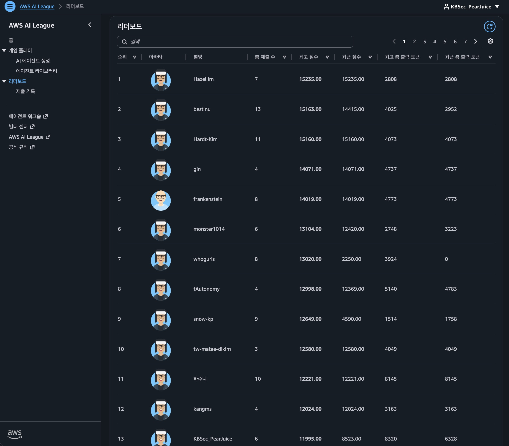

# AWS AI League 2026 Seoul Summit

> Amazon Bedrock AgentCore 기반 던전 탐색 AI 에이전트 — **13위 / 137명 (상위 ~10%)**



---

## About AWS AI League

[AWS AI League](https://aws.amazon.com/ai/aileague/)는 AWS가 주관하는 글로벌 AI 에이전트 경쟁 대회입니다. 개발자들이 Amazon SageMaker AI와 Amazon Bedrock을 활용하여 게임화된 토너먼트에서 AI 에이전트를 구축하고 경쟁합니다.

- **글로벌 챔피언십**: 총 상금 $50,000, Grand Finale는 re:Invent 2026에서 개최
- **두 가지 트랙**: Enterprise Events (기업 대상) / Developer Track (개인 개발자, AWS Summit에서 진행)
- **핵심 주제**: 모델 커스터마이징 + AI 에이전트 구축을 통한 실전 문제 해결

---

## About AWS Summit Seoul 2026

[AWS Summit Seoul 2026](https://aws.amazon.com/events/summits/seoul/)은 2026년 5월 20~21일 양일간 개최된 AWS 최대 규모 연례 컨퍼런스입니다.

- **일정**: 2026년 5월 20일(화) ~ 21일(수)
- **규모**: 100+ 세션, 70+ 고객 사례 발표
- **구성**: Day 1 = 산업별 적용 사례 (9개 산업 트랙), Day 2 = AI 집중 (에이전트, 모델, 인프라, 거버넌스)

### AI League 대회 세부사항

| 항목 | 내용 |
|------|------|
| 일시 | 2026년 5월 21일(수) 13:00 ~ 15:00 KST (2시간) |
| 장소 | Conference Room 3F E5 |
| 형식 | 개인전, 실시간 리더보드, 상위 3팀 라이브 결승전 |
| 상품 | 상위 입상자 re:Invent 2026 참가권 |
| 참가자 | 137명 |

---

## Competition Format

### Game Rules

제한 시간(5분) 내에 10x10 던전 맵을 탐색하여:
1. **코인(c7)** 수집으로 기본 점수 확보
2. **챌린지(c1~c5, c18, c30)** 해결로 고득점 획득
3. **보물(treasure)** 도달로 게임 완료
4. **생명(5개)** 보존으로 보너스 극대화

### Constraints

- **모델 제한**: Claude Haiku 4.5만 사용 가능 (외부 모델 호출 시 실격)
- **도구**: AWS Lambda 기반 도구만 사용 (추가 라이브러리 설치 불가)
- **Low/No-Code**: AI League UI + SageMaker Studio에서 설정 (CLI 권한 없음)
- **평가**: Game MAP과 Evaluation MAP의 챌린지 질문이 다름 (하드코딩 방지)

### Scoring Formula

```
총점 = 챌린지 점수 합계
     + 보물 보너스 (2000 + 남은생명 x 5)
     + 남은생명 x 250
     + 토큰 보너스: 1000 - (총토큰 / 방문챌린지수)
```

토큰을 적게 쓸수록, 생명을 많이 보존할수록 높은 점수를 얻습니다.

---

## Solution Architecture

### Agent Design

```
┌─────────────────────────────────────────────────┐
│           Supervisor Agent (Claude Haiku 4.5)     │
│           + AgentCore Memory + Guardrails         │
├─────────────────────────────────────────────────┤
│                                                   │
│  ┌──────────────┐  ┌──────────────┐             │
│  │ Pathfinding  │  │  Blue Brain  │             │
│  │  Specialist  │  │  Specialist  │             │
│  │  (Lambda)    │  │  (Lambda)    │             │
│  └──────────────┘  └──────────────┘             │
│                                                   │
│  ┌──────────────┐  ┌──────────────┐             │
│  │ Dark Prophet │  │ Medical API  │             │
│  │  Specialist  │  │  Specialist  │             │
│  │  (Lambda)    │  │  (Lambda)    │             │
│  └──────────────┘  └──────────────┘             │
│                                                   │
└─────────────────────────────────────────────────┘
```

### Amazon Bedrock AgentCore

[Amazon Bedrock AgentCore](https://aws.amazon.com/bedrock/agentcore/)는 프로덕션 AI 에이전트를 위한 플랫폼입니다.

본 프로젝트에서 활용한 AgentCore 서비스:

| 서비스 | 용도 |
|--------|------|
| **AgentCore Runtime** | 슈퍼바이저 + 서브에이전트 오케스트레이션 |
| **AgentCore Memory** | c40 열쇠 코드 저장, c3 맵 정보 recall |
| **AgentCore Gateway** | Lambda 도구를 MCP 프로토콜로 에이전트에 연결 |
| **Bedrock Guardrails** | c1 Violent Violet 차단 응답 자동화 |
| **Code Interpreter** | c2 Blue Brain 코드 실행 |

### Delegation Strategy

슈퍼바이저가 챌린지 유형을 판별하여 라우팅:

- **c2 (코드 실행)** → Blue_Brain_Specialist (Lambda Code Interpreter)
- **c4 (웹 검색)** → Dark_Prophet_Specialist (DuckDuckGo 스크래핑)
- **c18 (의료 API)** → Medical_API_Specialist (NLP→JSON)
- **Pathfinding** → Pathfinding_Specialist (BFS 경로 탐색)
- **c1, c3, c5, c30, c40** → 슈퍼바이저 직접 처리

---

## Key Challenges

| Challenge | Points | Type | Strategy |
|-----------|--------|------|----------|
| c1 Violent Violet | +400 | Guardrail | 유해 콘텐츠 요청 차단, 일반 질문 직접 답변 |
| c2 Blue Brain | +600 | Code | Lambda로 Python 코드 실행 (피보나치, 소수 등) |
| c3 Memento | +550 | Memory | AgentCore Memory에서 맵 정보 recall |
| c4 Dark Prophet | +800 | Web | 지정 URL 스크래핑으로 정보 추출 |
| c5 Bonehead | +250 | Q&A | 최종 답만 출력 (설명/단위 금지) |
| c7 Coin | +250 | Auto | 경로 통과 시 자동 수집 |
| c8 Spike | -1 life | Trap | BFS에서 blocked 처리로 회피 |
| c18 Medical API | +500 | NLP | 자연어 → JSON 5필드 변환 |
| c30 Red Door | +1000 / -5 | Puzzle | c40 열쇠 필수, 코드 역순 답변 |
| c40 Red Key | +50 | Memory | "감사합니다" 답변 + 코드 저장 |
| Treasure | +2000 | Goal | 최종 도달 (게임 즉시 종료) |

---

## Pathfinding Algorithm

`tools/pathfinding_tool.py` — Phase 기반 최적 경로 탐색:

```python
# 회피 셀 정의
AVOID_CELLS = {"wall", "c8", "treasure"}

# smart 전략 Phase 순서:
# 1. c30 통과 없이 도달 가능한 타겟 → greedy nearest 수집
# 2. c40 방문 (열쇠 획득)
# 3. c30 통과 필수 타겟 수집 (열쇠 획득 후 안전)
# 4. c30 방문 (열쇠코드 역순 답변)
# 5. Treasure (게임 종료 — 반드시 마지막)
```

핵심 설계:
- **도달 가능성 기반 분류**: c30 blocked 상태에서 BFS로 도달 가능 여부 판별
- **c30 조건부 회피**: c40 미획득 시 c30 셀을 wall처럼 취급 (통과 시 -5생명)
- **treasure 회피**: 최종 Phase 전까지 treasure를 blocked 처리 (도착 즉시 게임 종료)
- **Greedy nearest**: 클러스터 내 가장 가까운 타겟 우선 방문으로 백트래킹 최소화

지원 전략: `smart`, `key_chain`, `avoid_spikes`, `safe_coins`, `all_challenges`, `swift`, `get_coins`

---

## Model Customization (RLVR)

SageMaker AI Studio에서 Qwen3-0.6B 모델을 RLVR(Reinforcement Learning with Verifiable Rewards)로 커스터마이징하면 토큰 패널티를 감소시킬 수 있습니다.

| 커스터마이즈된 모델 수 | 토큰 패널티 감소 |
|---------------------|-----------|
| 1 | 50% |
| 2 | 70% |
| 3 | 85% |

본 프로젝트에서는 시간 제약으로 미적용했으나, 데이터셋과 보상함수를 준비해두었습니다:
- `scripts/generate_dataset.py` — Stage 1 Tool Calling 데이터셋 (500샘플)
- `scripts/reward_function.py` — Stage 1 보상 함수 (점진적 사다리)
- `scripts/generate_faithfulness_dataset.py` — Stage 2 Faithfulness 데이터셋
- `scripts/faithfulness_reward_function.py` — Stage 2 보상 함수 (exact match)

---

## Lessons Learned

1. **c30은 맵의 chokepoint** — c40 획득 전 BFS에서 반드시 blocked 처리해야 함. 위반 시 -5생명으로 즉사.
2. **Treasure 통과 = 즉시 게임 종료** — 다른 타겟으로 가는 경유지로 사용 불가.
3. **토큰 절약이 곧 점수** — "Output ONLY the final answer" 한 줄 추가로 보너스 +100점 이상.
4. **Guardrail 오분류 치명적** — c5 일반 질문("광합성이란?")을 c1 가드레일로 잘못 차단하면 점수 + 생명 동시 손실.
5. **Lambda 배포 ≠ 저장** — SageMaker Studio에서 코드 저장과 클라우드 배포는 별개 동작. 반드시 검증 필요.
6. **System Prompt 개선이 가장 ROI 높음** — 코드 수정 없이 프롬프트 한 줄로 에이전트 행동 즉시 변경 가능.

---

## Project Structure

```
.
├── README.md                          # This file
├── CLAUDE.md                          # Project context for Claude Code
├── Plan.md                            # Competition execution summary
├── game4_analysis.md                  # Best run analysis
│
├── agent/
│   ├── supervisor_prompt_v2.txt       # Final supervisor system prompt
│   ├── supervisor_prompt_plain.txt    # v1 prompt (no markdown)
│   ├── supervisor_prompt.md           # Prompt version history
│   ├── system_prompt.txt              # Korean reference version
│   └── pathfinding_subagent_prompt.txt
│
├── tools/
│   ├── pathfinding_tool.py            # Final pathfinding lambda
│   ├── pathfinding_tool_v1.py         # Previous version (archive)
│   ├── blue_brain_tool.py             # Code execution (c2)
│   ├── dark_prophet_tool.py           # Web scraping (c4)
│   └── medical_api_tool.py            # JSON extraction (c18)
│
├── scripts/
│   ├── inspect_infra.py               # Infrastructure auto-discovery
│   ├── generate_dataset.py            # RLVR Stage 1 dataset generator
│   ├── reward_function.py             # RLVR Stage 1 reward function
│   ├── generate_faithfulness_dataset.py  # Stage 2 dataset
│   └── faithfulness_reward_function.py   # Stage 2 reward function
│
├── originals/                         # Original code backup (for recovery)
├── game-logs/                         # Game event logs (5 runs)
├── assets/                            # Screenshots
├── cheatsheets/                       # Service-specific cheatsheets
└── docs/                              # Workshop guides
```

---

## Tech Stack

| Category | Technology |
|----------|-----------|
| Agent Orchestration | Amazon Bedrock AgentCore |
| LLM | Claude Haiku 4.5 (Anthropic via Bedrock) |
| Tools | AWS Lambda (Python 3.12) |
| Memory | AgentCore Memory API |
| Guardrails | Amazon Bedrock Guardrails |
| Model Customization | SageMaker AI Studio + RLVR |
| Development | Claude Code (prompt engineering + code generation) |

---

## Links

- [AWS AI League](https://aws.amazon.com/ai/aileague/)
- [AWS Summit Seoul 2026](https://aws.amazon.com/events/summits/seoul/)
- [Amazon Bedrock AgentCore](https://aws.amazon.com/bedrock/agentcore/)

---

## License

This project was created for the AWS AI League 2026 Seoul Summit competition.
